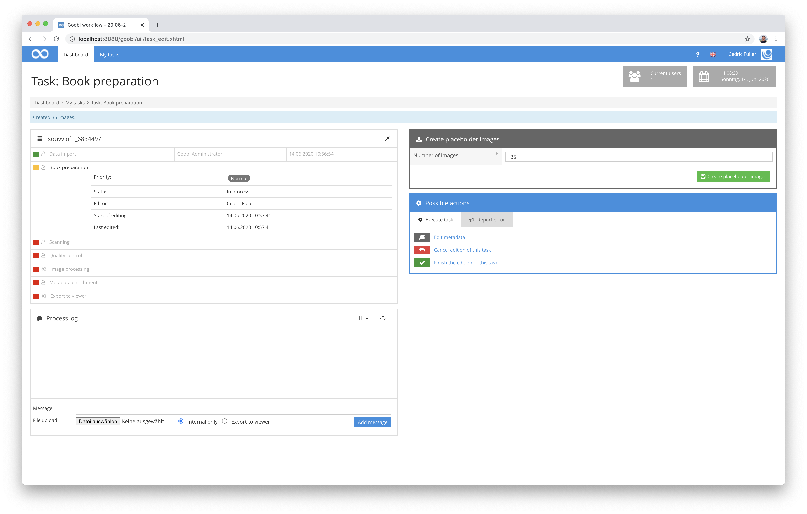
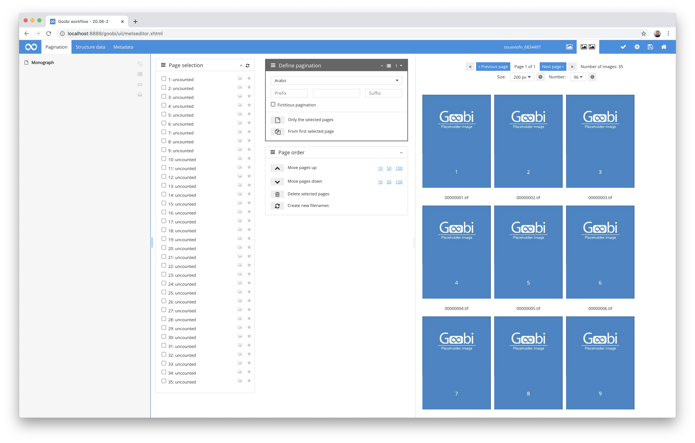

## Introduction
This plugin is used to generate placeholder images within the master folder of a Goobi workflow process. The number of images to be generated can be defined in the user interface.


## Installation
To use the plugin, these two files must be copied to the following locations:

```bash
/opt/digiverso/goobi/plugins/step/plugin_intranda_step_placeholder-base.jar
/opt/digiverso/goobi/plugins/GUI/plugin_intranda_step_placeholder-gui.jar
```

This plugin has no configuration file and is therefore not configurable.


## Overview and functionality 
This plugin is integrated into the workflow so that it is available for a selected task. After accepting the task, the user can specify the number of images to be generated by the plugin and confirms this. Immediately afterwards, the plugin generates the defined number of images and stores them within the master folder of the process.



From this moment on, the generated placeholder images exist for the process and can be displayed and replaced in the course of the further workflow.


